# Comprehensive Analysis: Markdown Renderer Application

## Executive Summary

The markdown-renderer is a sophisticated Progressive Web Application (PWA) built with React, TypeScript, and Vite. It provides real-time markdown editing and rendering capabilities with advanced features including offline support, URL sharing, QR code generation, and comprehensive PWA functionality. The application demonstrates modern web development best practices with a focus on performance, accessibility, and user experience.

## Table of Contents

1. [Software Architect Perspective](#software-architect-perspective)
2. [Software Developer Perspective](#software-developer-perspective)
3. [Product Manager Perspective](#product-manager-perspective)
4. [Technical Architecture](#technical-architecture)
5. [Key Features and Capabilities](#key-features-and-capabilities)
6. [Development and Deployment](#development-and-deployment)
7. [Quality Assurance](#quality-assurance)
8. [Recommendations](#recommendations)

---

## Software Architect Perspective

### System Architecture Overview

The application follows a modern, component-based architecture with clear separation of concerns:

```mermaid
graph TB
    subgraph "Frontend Application"
        A[App.tsx - Main Entry Point] --> B[Component Layer]
        A --> C[Hook Layer]
        A --> D[Utility Layer]
        
        B --> B1[Editor Component]
        B --> B2[Viewer Component]
        B --> B3[Header Component]
        B --> B4[PWA Components]
        
        C --> C1[useMarkdown Hook]
        C --> C2[usePWA Hook]
        C --> C3[useTheme Hook]
        C --> C4[useEncoding Hook]
        
        D --> D1[Markdown Utils]
        D --> D2[Storage Utils]
        D --> D3[Encoding Utils]
        D --> D4[QR Code Utils]
    end
    
    subgraph "PWA Infrastructure"
        E[Service Worker] --> F[Caching Strategy]
        E --> G[Offline Support]
        E --> H[Update Management]
    end
    
    subgraph "External Services"
        I[GitHub Pages Hosting]
        J[Browser APIs]
        K[Local Storage]
    end
    
    A --> E
    D --> K
    B --> J
```

### Architectural Patterns

1. **Component Composition**: React components are designed for reusability and maintainability
2. **Custom Hooks Pattern**: Business logic encapsulated in reusable hooks
3. **Utility Pattern**: Pure functions for data transformation and storage
4. **PWA Architecture**: Service worker implementation for offline-first experience
5. **State Management**: React state with localStorage persistence

### Technology Stack

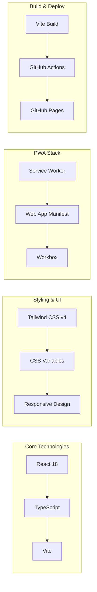

### Data Flow Architecture

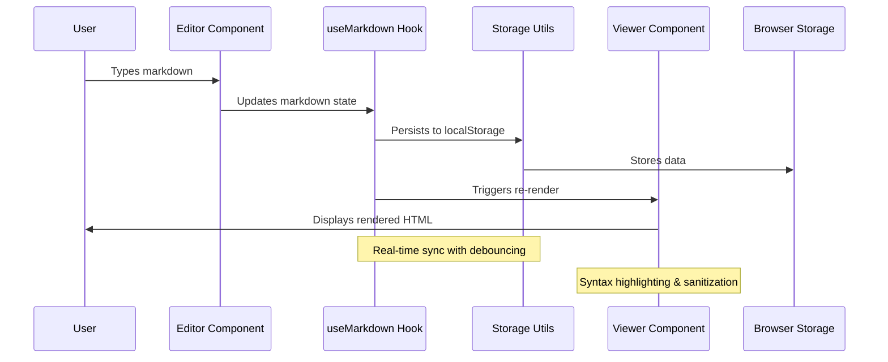

---

## Software Developer Perspective

### Code Organization and Structure

The codebase demonstrates excellent organization with clear separation of concerns:

#### Component Architecture

- **Editor.tsx**: Advanced markdown editor with syntax highlighting, auto-save, and encoding support
- **Viewer.tsx**: Secure HTML renderer with DOMPurify sanitization and syntax highlighting
- **Header.tsx**: Navigation and utility controls (theme, sharing, PWA features)
- **PWA Components**: Comprehensive offline support and update management

#### Custom Hooks Implementation

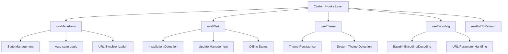

#### Key Development Features

1. **Type Safety**: Comprehensive TypeScript implementation with strict configuration
2. **Performance Optimization**: React.memo, lazy loading, and debounced operations
3. **Error Handling**: Graceful degradation and user-friendly error messages
4. **Accessibility**: ARIA labels, keyboard navigation, and screen reader support
5. **Security**: DOMPurify sanitization for user-generated content

### Build and Development Workflow

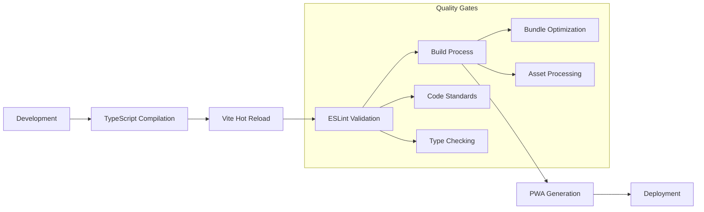

### Testing Strategy

- **Lighthouse Integration**: Automated PWA quality testing
- **PWA Testing Scripts**: Custom validation for offline functionality
- **Manual Testing Guides**: Comprehensive testing procedures for PWA features

---

## Product Manager Perspective

### Product Vision and Value Proposition

The markdown-renderer serves as a comprehensive solution for markdown editing and sharing with these core value propositions:

1. **Instant Accessibility**: No registration or installation required
2. **Universal Sharing**: URL-based content sharing with QR code generation
3. **Offline Capability**: Full functionality without internet connection
4. **Cross-Platform**: Works on desktop, tablet, and mobile devices
5. **Developer-Friendly**: Clean, distraction-free interface with advanced features

### Feature Matrix

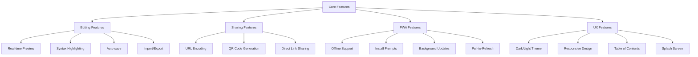

### User Journey Mapping

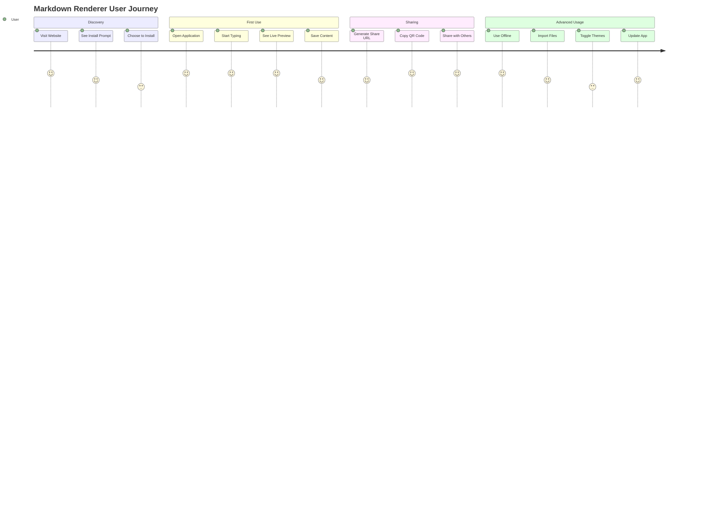

### Competitive Advantages

1. **No Account Required**: Immediate usability without barriers
2. **URL-Based Sharing**: Unique approach to content distribution
3. **Full PWA Implementation**: Native app-like experience
4. **Encoding Innovation**: Secure, URL-safe content encoding
5. **Comprehensive Offline Support**: True offline-first architecture

---

## Technical Architecture

### Application Flow Diagram

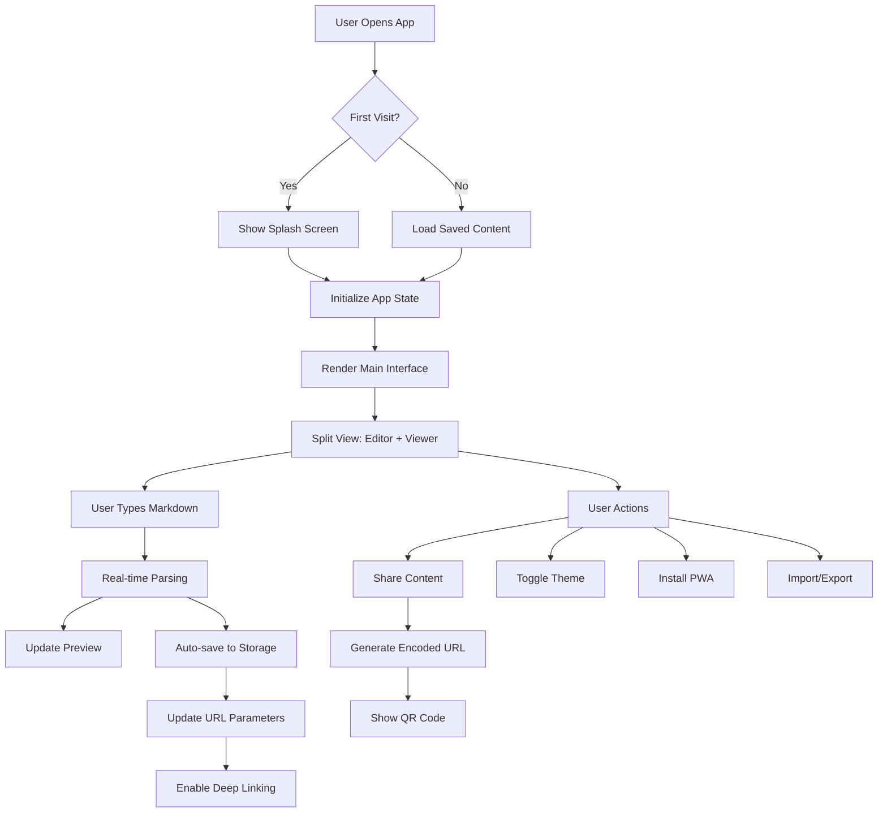

### Data Storage Architecture

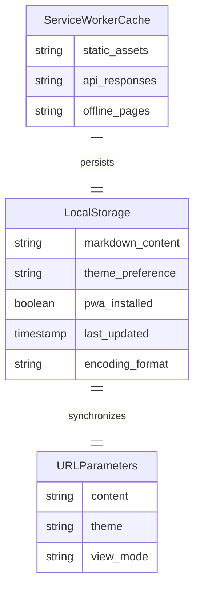

### Component Interaction Diagram

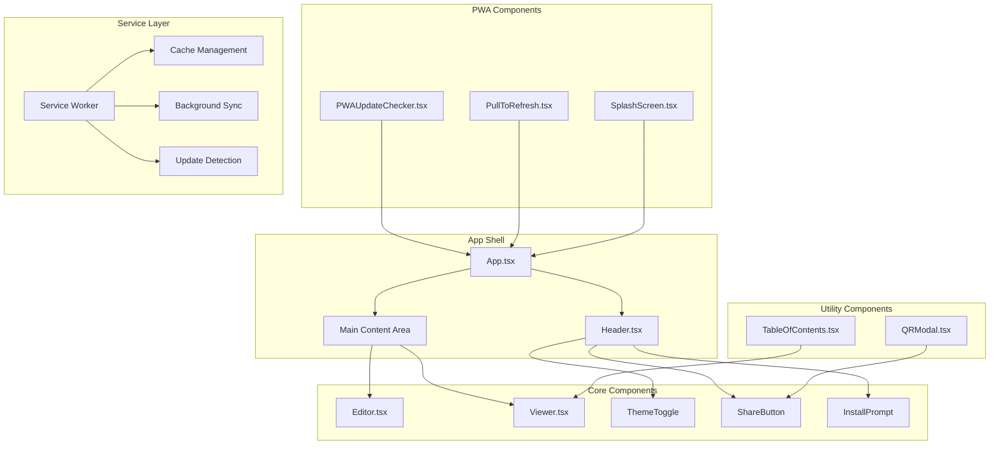

---

## Key Features and Capabilities

### 1. Real-Time Markdown Processing

- **Live Preview**: Instant rendering as users type
- **Syntax Highlighting**: Code blocks with language detection
- **Security**: DOMPurify sanitization of generated HTML
- **Performance**: Debounced processing to prevent lag

### 2. Advanced Sharing Mechanisms

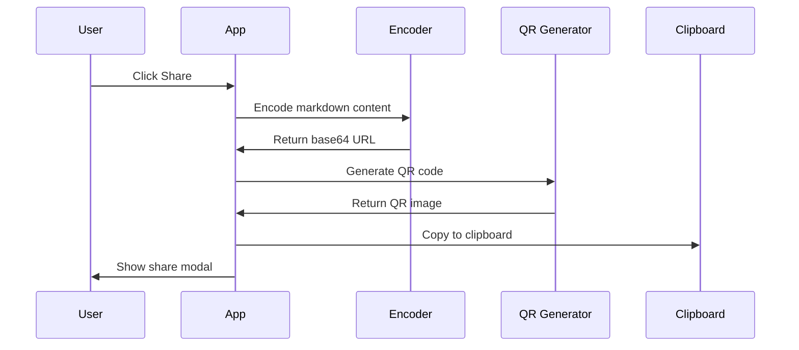

### 3. Progressive Web App Features

- **Installability**: Native app installation prompts
- **Offline Support**: Full functionality without internet
- **Background Updates**: Automatic app updates with user notification
- **Mobile Optimization**: Touch gestures and mobile-specific features

### 4. Encoding and Security

- **URL-Safe Encoding**: Base64 encoding for content sharing
- **Content Sanitization**: XSS prevention through DOMPurify
- **Secure Defaults**: CSP headers and secure coding practices

---

## Development and Deployment

### Build Pipeline

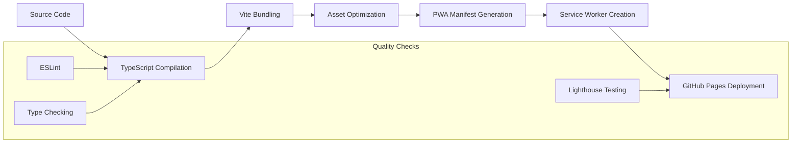

### Deployment Strategy

- **Hosting**: GitHub Pages with custom domain support
- **CI/CD**: GitHub Actions for automated deployment
- **Caching**: Aggressive caching strategy with service worker
- **Updates**: Progressive enhancement with backward compatibility

### Environment Configuration

- **Development**: Hot module replacement with Vite
- **Production**: Optimized bundles with tree-shaking
- **Testing**: Lighthouse CI for PWA quality assurance

---

## Quality Assurance

### Testing Approach

1. **Automated Testing**
   - Lighthouse CI integration
   - PWA compliance testing
   - Build process validation

2. **Manual Testing**
   - Cross-browser compatibility
   - Mobile device testing
   - Offline functionality validation

3. **Performance Monitoring**
   - Bundle size optimization
   - Load time monitoring
   - PWA score tracking

### Code Quality Measures

- **TypeScript**: Strict type checking
- **ESLint**: Code style and quality enforcement
- **Code Organization**: Clear separation of concerns
- **Documentation**: Comprehensive inline documentation

---

## Recommendations

### Short-Term Improvements

1. **Enhanced Editor Features**
   - Add vim/emacs key bindings
   - Implement find/replace functionality
   - Add word count and reading time

2. **Collaboration Features**
   - Real-time collaborative editing
   - Comment system for shared documents
   - Version history tracking

3. **Export Enhancements**
   - PDF export functionality
   - Multiple markdown flavors support
   - Custom CSS themes for export

### Medium-Term Roadmap

1. **Plugin Architecture**
   - Custom markdown extensions
   - Third-party plugin support
   - Theme customization system

2. **Cloud Integration**
   - Optional cloud storage
   - Cross-device synchronization
   - Backup and restore features

3. **Advanced PWA Features**
   - Background processing
   - Push notifications
   - Offline analytics

### Long-Term Vision

1. **Platform Expansion**
   - Native mobile applications
   - Desktop Electron app
   - Browser extension

2. **Enterprise Features**
   - Team collaboration tools
   - Advanced security features
   - Integration with popular tools

3. **AI Integration**
   - Writing assistance
   - Content optimization
   - Smart formatting suggestions

---

## Conclusion

The markdown-renderer application represents a well-architected, modern web application that successfully balances simplicity with powerful features. Its progressive web app implementation, comprehensive offline support, and innovative sharing mechanisms make it a standout solution in the markdown editing space.

The codebase demonstrates excellent software engineering practices with clear separation of concerns, comprehensive type safety, and thoughtful user experience design. The application is well-positioned for future enhancements while maintaining its core value proposition of simplicity and accessibility.

Key strengths include:
- Robust PWA implementation
- Innovative URL-based sharing
- Excellent code organization
- Comprehensive offline support
- Modern development practices

This analysis provides a foundation for understanding the application's architecture and guides future development decisions to maintain its high-quality standards while expanding capabilities.
