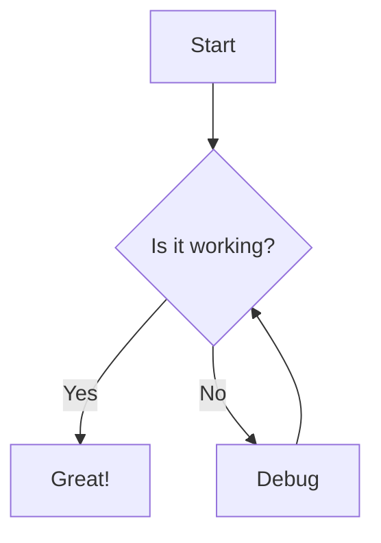

# 📝 Markdown Document Viewer

[](https://github.com/thomasrohde/markdown-renderer/actions/workflows/deploy.yml)
[](https://opensource.org/licenses/MIT)
[](https://web.dev/progressive-web-apps/)

> 🚀 **[Live Demo](https://thomasrohde.github.io/markdown-renderer/)** - Try it now!

A modern, fast, and privacy-focused Progressive Web Application for creating, viewing, and sharing Markdown documents instantly through URL encoding. No servers, no databases, no tracking - everything runs entirely in your browser.


## ✨ Features

### 🔥 Core Features
- **📱 Progressive Web App** - Install on any device, works offline with install prompts
- **🔗 Instant Sharing** - Share documents via URL encoding (no server required)
- **🔐 Password Protection** - Encrypt documents with AES-256-GCM encryption for secure sharing
- **🎨 GitHub-Flavored Markdown** - Full support for tables, code blocks, and more
- **🌙 Dark Mode** - Beautiful dark/light/system theme support with automatic detection
- **📱 Responsive Design** - Perfect on desktop, tablet, and mobile
- **🔒 Privacy-First** - Everything runs locally, no data collection

### 🛠️ Advanced Features
- **💾 Offline-First** - Full functionality without internet connection
- **🔐 Password Protection** - AES-256-GCM encryption for sensitive documents
- **🗜️ Smart Compression** - Efficient gzip compression for large documents
- **📋 One-Click Copy** - Copy shareable links instantly
- **👀 Live Preview** - Side-by-side editing and preview
- **🔄 Auto-Save** - Never lose your work with IndexedDB storage
- **📖 Source View** - Toggle between rendered and source view
- **📑 Table of Contents** - Auto-generated TOC with smooth scrolling navigation
- **📱 QR Code Sharing** - Generate QR codes for easy mobile sharing
- **🎨 Syntax Highlighting** - Prism.js powered code highlighting for 15+ languages

### 📝 Enhanced Markdown Support
- Headers with auto-generated IDs for TOC navigation
- Lists (ordered, unordered, task lists)
- **Advanced Code Blocks** - Syntax highlighting for JavaScript, TypeScript, Python, Java, CSS, JSON, SQL, YAML, Bash, and more
- **📊 Mermaid Diagrams** - Flowcharts, sequence diagrams, and more
- Tables with proper styling
- Links and images
- Blockquotes and horizontal rules
- Strikethrough and emphasis

## 🚀 Quick Start

### Try Online
Visit **[https://thomasrohde.github.io/markdown-renderer/](https://thomasrohde.github.io/markdown-renderer/)** to start using the app immediately.

### Install as PWA
1. Visit the live demo on your mobile device or desktop
2. Look for the "Install" prompt or add to home screen option
3. Enjoy native app-like experience with offline support

### Local Development

```bash
# Clone the repository
git clone https://github.com/thomasrohde/markdown-renderer.git
cd markdown-renderer

# Install dependencies
npm install

# Start development server
npm run dev

# Build for production
npm run build

# Preview production build
npm run preview
```

## 🔧 Technology Stack

### Frontend
- **[React 19](https://react.dev/)** - Modern UI library with latest features
- **[TypeScript](https://www.typescriptlang.org/)** - Type-safe development
- **[Vite](https://vitejs.dev/)** - Lightning-fast build tool
- **[Tailwind CSS](https://tailwindcss.com/)** - Utility-first CSS framework

### Markdown & Processing
- **[Marked](https://marked.js.org/)** - Fast markdown parser with custom renderer
- **[DOMPurify](https://github.com/cure53/DOMPurify)** - XSS protection
- **[Pako](https://github.com/nodeca/pako)** - Gzip compression
- **[Prism.js](https://prismjs.com/)** - Syntax highlighting for code blocks
- **[Mermaid](https://mermaid.js.org/)** - Diagram and flowchart rendering
- **[QRCode](https://github.com/soldair/node-qrcode)** - QR code generation for sharing

### PWA & Storage
- **[Vite PWA](https://vite-pwa-org.netlify.app/)** - PWA capabilities with install prompts
- **[IDB](https://github.com/jakearchibald/idb)** - IndexedDB wrapper for local storage
- **Service Worker** - Offline functionality and caching

## 📱 Phase 2 Features

### 🎨 Enhanced UI/UX
- **Intelligent Theme System** - Light, dark, or automatic system theme detection
- **Floating Table of Contents** - Auto-generated navigation with smooth scrolling
- **PWA Install Prompts** - Native-like installation experience
- **QR Code Sharing** - Generate QR codes for easy mobile access

### 🔧 Advanced Markdown Features
- **Mermaid Diagram Support** - Create flowcharts, sequence diagrams, and more
- **Enhanced Syntax Highlighting** - Prism.js support for 15+ programming languages
- **Auto-Generated IDs** - Headings automatically get IDs for deep linking
- **Rich Code Blocks** - Syntax highlighting for JavaScript, TypeScript, Python, Java, CSS, JSON, SQL, YAML, Bash, and more

### 💾 Local Storage & PWA
- **IndexedDB Integration** - Persistent local storage for documents and settings
- **Enhanced PWA Features** - Better offline support and native app experience
- **Document Management** - Save, load, and manage documents locally
- **Settings Persistence** - Theme preferences and editor settings remembered

## 📖 How It Works

### URL Encoding Magic
The app uses an innovative approach to share documents:

1. **Write** your markdown content in the editor
2. **Optionally Encrypt** with password protection using AES-256-GCM
3. **Compress** using gzip compression
4. **Encode** to base64 for URL safety
5. **Share** via query parameter or URL fragment

```
Regular documents:    ?doc=<base64-encoded-content>
Long documents:       #doc=<base64-encoded-content>
Password protected:   ?doc=pw:<encrypted-base64-content>
                      #doc=pw:<encrypted-base64-content>
```

### 🔐 Password Protection
Secure your sensitive documents with military-grade encryption:

#### **Client-Side Encryption**
- **AES-256-GCM** encryption with PBKDF2 key derivation
- **100,000 iterations** for strong password-based key generation
- **Random salt and IV** for each document (no rainbow table attacks)
- **Zero server storage** - encrypted content travels in the URL

#### **How to Use**
1. **Create Document** - Write your markdown content
2. **Enable Protection** - Click "Generate Protected Link" 
3. **Set Password** - Enter a strong password (remember it!)
4. **Share Securely** - Copy the generated link
5. **Access Anywhere** - Recipients enter password to decrypt

#### **Security Features**
- **Browser-Only** - Encryption happens entirely in your browser
- **No Server Storage** - Passwords never leave your device
- **Forward Secrecy** - Each document uses unique cryptographic parameters
- **Tamper Detection** - AES-GCM provides built-in integrity verification

### Mermaid Diagram Rendering
The app now supports interactive Mermaid diagrams:

````markdown

````

### Syntax Highlighting
Code blocks are automatically highlighted based on the specified language:

````markdown
```typescript
interface User {
    id: number;
    name: string;
}
```
````

### Smart Compression & Advanced Features
- Documents up to ~100KB are supported
- Automatic compression reduces URL size by 60-80%
- Fallback to fragment URLs for larger content
- Efficient handling of repeated content
- **QR Code Generation** - Easy mobile sharing with generated QR codes
- **Auto Table of Contents** - Generated from document headings with smooth scrolling
- **Persistent Storage** - Documents saved locally with IndexedDB
- **Theme Persistence** - Remembers your preferred theme across sessions

## 🔐 Password Protection Feature

### Overview
Protect your sensitive markdown documents with industry-standard AES-256-GCM encryption. Perfect for confidential notes, private documentation, secure team communication, and sensitive content sharing.

### Security Specifications
- **Encryption Algorithm**: AES-256-GCM (Galois/Counter Mode)
- **Key Derivation**: PBKDF2 with SHA-256
- **Iterations**: 100,000 (OWASP recommended minimum)
- **Salt**: 128-bit random salt per document
- **IV/Nonce**: 96-bit random initialization vector
- **Integrity**: Built-in authentication and tamper detection

### How to Use Password Protection

#### **Creating Protected Documents**
1. **Write Content** - Create your markdown document
2. **Enable Protection** - Click "Generate Protected Link" button
3. **Set Password** - Enter a strong password in the modal
4. **Generate Link** - System encrypts and creates shareable URL
5. **Share Securely** - Copy the link and share with intended recipients

#### **Accessing Protected Documents**
1. **Open Link** - Click or navigate to the protected document URL
2. **Enter Password** - System prompts for the protection password
3. **Decrypt & View** - Document is decrypted and displayed locally
4. **Security Validation** - Invalid passwords are rejected immediately

### Security Best Practices
- **Strong Passwords** - Use complex passwords with mixed characters
- **Secure Sharing** - Share passwords through separate, secure channels
- **Limited Access** - Only share with intended recipients
- **Password Management** - Use a password manager for complex passwords
- **Regular Updates** - Consider re-encrypting sensitive documents periodically

### Browser Compatibility
- **Chrome/Edge 37+** - Full support for Web Crypto API
- **Firefox 34+** - Complete encryption functionality
- **Safari 8+** - Full compatibility on macOS and iOS
- **Mobile Browsers** - Works on all modern mobile browsers
- **Graceful Fallback** - Clear error messages for unsupported browsers

## 🎯 Use Cases

### 🎓 Education & Documentation
- Share lecture notes instantly with QR codes
- **Secure student assignments** with password-protected documents
- Create interactive tutorials with Mermaid diagrams
- Distribute assignments with syntax-highlighted code examples
- Collaborative note-taking with persistent storage
- **Confidential course materials** protected by encryption
- Technical documentation with auto-generated table of contents

### 💼 Professional & Development
- Technical specifications with diagram support
- **Confidential project proposals** with password protection
- Project proposals with rich formatting
- Code snippets with multi-language syntax highlighting
- **Secure team communication** with encrypted sharing
- Team communication with shareable QR codes
- **Protected API documentation** for sensitive systems
- API documentation with structured navigation

### 🌐 Content Creation & Sharing
- Blog post drafts with live preview
- **Protected drafts and private content** with encryption
- README files with enhanced markdown features
- Change logs with proper formatting
- **Secure internal documentation** with password access
- Release notes with visual diagrams
- Mobile-friendly sharing via QR codes

## 🛡️ Privacy & Security

- **No Data Collection** - Zero tracking, analytics, or data harvesting
- **Client-Side Only** - All processing happens in your browser
- **Military-Grade Encryption** - AES-256-GCM for password-protected documents
- **XSS Protection** - DOMPurify sanitizes all rendered content including SVG diagrams
- **Local Storage** - Documents stored locally in IndexedDB, never transmitted
- **No External Dependencies** - Works completely offline after initial load
- **Password Security** - Passwords never leave your device or stored anywhere
- **Cryptographic Security** - PBKDF2 with 100,000 iterations, random salts and IVs
- **Open Source** - Full transparency, inspect the code yourself
- **Secure Sharing** - URLs contain compressed content, no server storage required

## 📱 Browser Support

- **Chrome/Edge** 88+ (full PWA support)
- **Firefox** 84+ (core features)
- **Safari** 14+ (iOS/macOS support)
- **Mobile browsers** - Full responsive support

## 🤝 Contributing

We welcome contributions! Here's how you can help:

### 🐛 Bug Reports
1. Check existing issues first
2. Create a detailed bug report with steps to reproduce
3. Include browser and OS information

### ✨ Feature Requests
1. Search existing feature requests
2. Create a new issue with detailed description
3. Explain the use case and benefits

### 🔧 Development
1. Fork the repository
2. Create a feature branch (`git checkout -b feature/amazing-feature`)
3. Make your changes with proper tests
4. Commit with conventional commit messages
5. Push and create a Pull Request

### 📝 Development Guidelines
- Follow TypeScript best practices
- Add proper JSDoc comments
- Ensure responsive design
- Test on multiple browsers
- Keep bundle size minimal

## 📋 Scripts

```bash
npm run dev          # Start development server
npm run build        # Build for production
npm run preview      # Preview production build
npm run deploy       # Deploy to GitHub Pages
npm run test         # Run test suite
npm run test:pwa     # Test PWA with Lighthouse
npm run lint         # Run ESLint
```

## 🏗️ Project Structure

```
src/
├── components/              # React components
│   ├── Editor.tsx          # Markdown editor with auto-save
│   ├── Header.tsx          # App header with theme toggle
│   ├── Viewer.tsx          # Document viewer with TOC
│   ├── TableOfContents.tsx # Auto-generated navigation
│   ├── QRModal.tsx         # QR code generation modal
│   ├── PasswordModal.tsx   # Password protection dialog
│   └── InstallPrompt.tsx   # PWA installation prompt
├── hooks/                  # Custom React hooks
│   ├── useEncoding.ts      # URL encoding/decoding
│   ├── useMarkdown.ts      # Markdown processing
│   ├── useTheme.ts         # Theme management
│   └── usePWA.ts          # PWA installation handling
├── utils/                  # Utility functions
│   ├── encoding.ts         # Compression & encryption utilities
│   ├── crypto.ts           # AES-256-GCM encryption functions
│   ├── markdown.ts         # Markdown rendering with Prism & Mermaid
│   ├── storage.ts          # IndexedDB storage management
│   └── qrcode.ts          # QR code generation
├── config/                 # App configuration
│   └── constants.ts        # App constants
└── styles/                 # Global styles with dark mode
```

## 📄 License

This project is licensed under the MIT License - see the [LICENSE](LICENSE) file for details.

## 📋 Changelog

### Phase 2 (Latest) - Advanced Features & Enhanced UX
- ✨ **Mermaid Diagram Support** - Render flowcharts, sequence diagrams, and more
- 🎨 **Enhanced Syntax Highlighting** - Prism.js integration with 15+ languages
- 📑 **Auto Table of Contents** - Generated from headings with smooth scrolling
- 🌙 **Advanced Theme System** - Light/dark/system theme with persistence
- 📱 **QR Code Sharing** - Generate QR codes for easy mobile access
- 🔐 **Password Protection** - AES-256-GCM encryption for sensitive documents
- 💾 **IndexedDB Storage** - Persistent local document and settings storage
- 🔧 **Enhanced PWA Features** - Better install prompts and offline support
- 🎯 **Auto-Generated IDs** - Headings get IDs for deep linking and navigation
- 🛠️ **Improved Editor** - Better auto-save and document management
- 🔒 **Enhanced Security** - Military-grade encryption and extended XSS protection

### Phase 1 - Core Foundation
- 📝 **Basic Markdown Rendering** - GitHub-flavored markdown support
- 🔗 **URL Encoding** - Share documents via compressed URLs
- 📱 **PWA Basics** - Progressive web app functionality
- 🎨 **Responsive Design** - Mobile-first responsive layout
- 🌙 **Basic Dark Mode** - Simple dark/light theme toggle
- 💾 **Offline Support** - Basic service worker implementation

## 🙏 Acknowledgments

- [Marked](https://marked.js.org/) for excellent markdown parsing
- [Prism.js](https://prismjs.com/) for beautiful syntax highlighting
- [Mermaid](https://mermaid.js.org/) for powerful diagram rendering
- [QRCode](https://github.com/soldair/node-qrcode) for QR code generation
- [IDB](https://github.com/jakearchibald/idb) for IndexedDB wrapper
- [Tailwind CSS](https://tailwindcss.com/) for beautiful styling
- [Vite](https://vitejs.dev/) for amazing developer experience
- [React](https://react.dev/) team for the fantastic framework

## 🔗 Links

- **Live Demo**: [https://thomasrohde.github.io/markdown-renderer/](https://thomasrohde.github.io/markdown-renderer/)
- **Repository**: [https://github.com/thomasrohde/markdown-renderer](https://github.com/thomasrohde/markdown-renderer)
- **Issues**: [Report bugs or request features](https://github.com/thomasrohde/markdown-renderer/issues)

---

<div align="center">
  <p>Made with ❤️ for the developer community</p>
  <p>
    <a href="https://thomasrohde.github.io/markdown-renderer/">Try it now</a> •
    <a href="https://github.com/thomasrohde/markdown-renderer/issues">Report Bug</a> •
    <a href="https://github.com/thomasrohde/markdown-renderer/issues">Request Feature</a>
  </p>
</div>