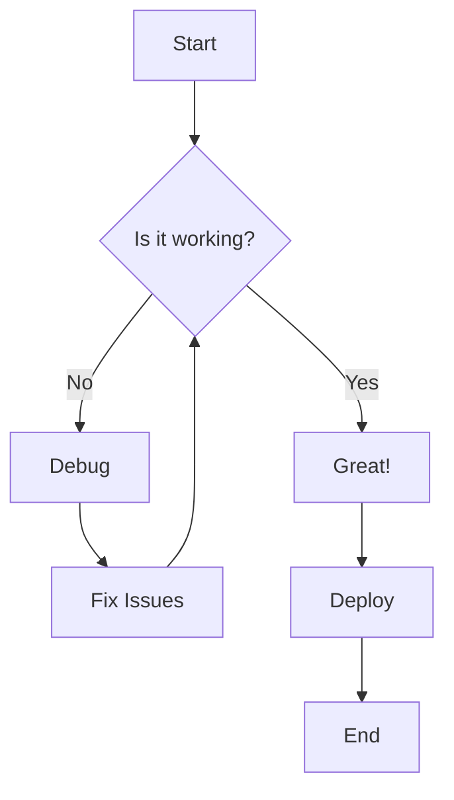
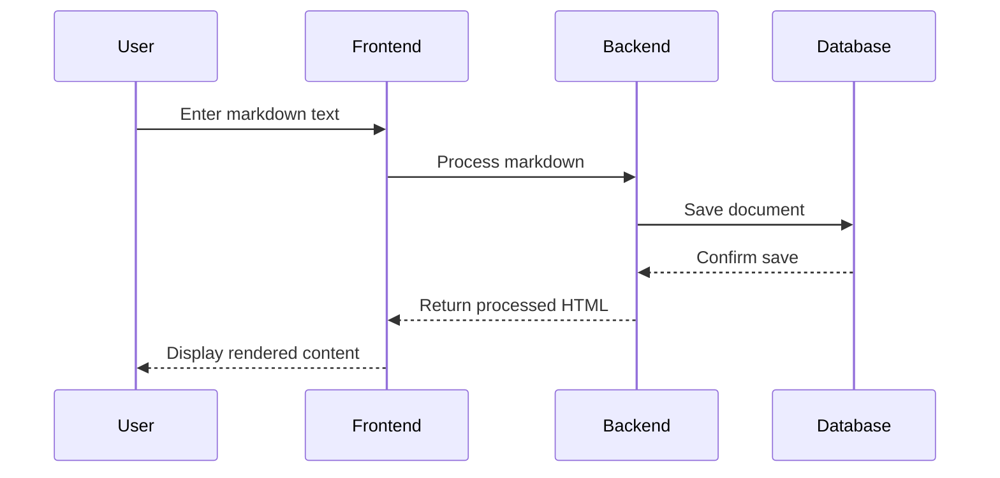
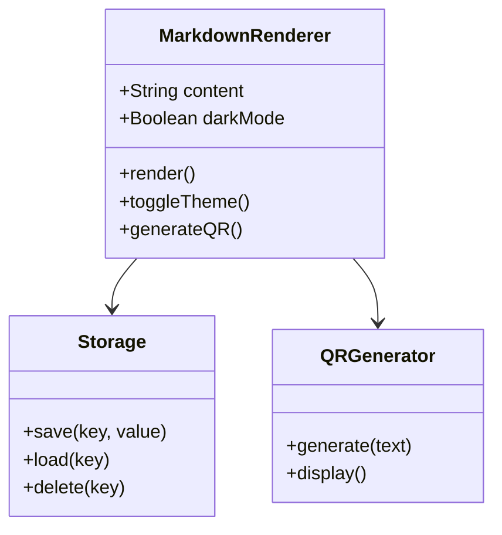
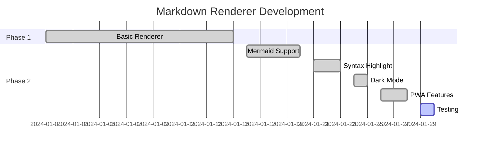

# Phase 2 Feature Test Document

## Table of Contents Test
This document will test all Phase 2 features including:
- Mermaid diagrams
- Syntax highlighting
- Table of contents generation
- Dark mode toggle
- QR code sharing
- PWA install functionality

## Code Syntax Highlighting

### JavaScript
```javascript
// Function to calculate factorial
function factorial(n) {
    if (n <= 1) return 1;
    return n * factorial(n - 1);
}

console.log(factorial(5)); // Output: 120
```

### TypeScript
```typescript
interface User {
    id: number;
    name: string;
    email: string;
}

class UserService {
    private users: User[] = [];
    
    addUser(user: User): void {
        this.users.push(user);
    }
    
    getUser(id: number): User | undefined {
        return this.users.find(user => user.id === id);
    }
}
```

### Python
```python
def fibonacci(n):
    """Generate Fibonacci sequence up to n terms"""
    if n <= 0:
        return []
    elif n == 1:
        return [0]
    elif n == 2:
        return [0, 1]
    
    sequence = [0, 1]
    for i in range(2, n):
        sequence.append(sequence[i-1] + sequence[i-2])
    
    return sequence

print(fibonacci(10))  # [0, 1, 1, 2, 3, 5, 8, 13, 21, 34]
```

### CSS
```css
.dark-theme {
    --bg-color: #1a1a1a;
    --text-color: #ffffff;
    --accent-color: #007acc;
}

.button {
    background-color: var(--accent-color);
    color: var(--text-color);
    border: none;
    border-radius: 8px;
    padding: 12px 24px;
    cursor: pointer;
    transition: all 0.3s ease;
}

.button:hover {
    transform: translateY(-2px);
    box-shadow: 0 4px 12px rgba(0, 122, 204, 0.3);
}
```

## Mermaid Diagrams

### Flowchart


### Sequence Diagram


### Class Diagram


### Gantt Chart


## Tables

| Feature | Status | Priority | Notes |
|---------|--------|----------|-------|
| Mermaid Diagrams | ✅ Complete | High | Supports multiple diagram types |
| Syntax Highlighting | ✅ Complete | High | Prism.js integration |
| Dark Mode | ✅ Complete | Medium | System preference detection |
| PWA Install | ✅ Complete | Medium | Service worker ready |
| QR Sharing | ✅ Complete | Low | Easy mobile access |
| Table of Contents | ✅ Complete | Medium | Auto-generated navigation |

## Lists and Formatting

### Ordered List
1. **Phase 1**: Basic markdown rendering
2. **Phase 2**: Enhanced features
   - Mermaid diagram support
   - Syntax highlighting with Prism.js
   - Dark mode toggle
   - PWA functionality
3. **Phase 3**: Advanced features (future)

### Unordered List
- ✅ **Completed Features**
  - Markdown to HTML conversion
  - DOMPurify sanitization
  - Responsive design
  - IndexedDB storage
- 🚧 **In Progress**
  - Testing and validation
  - Performance optimization
- 📋 **Planned**
  - Export functionality
  - Collaborative editing

## Blockquotes

> "The best way to predict the future is to invent it." - Alan Kay

> **Note**: This markdown renderer now supports all major Phase 2 features including:
> - Advanced diagram rendering with Mermaid
> - Multi-language syntax highlighting
> - Progressive Web App capabilities
> - Dark mode with system preference detection

## Horizontal Rules

---

## Emphasis and Strong

This text has *italic emphasis* and **bold strength**.
You can also combine ***both*** for maximum impact.

~~Strikethrough~~ text is also supported.

## Links and Images

Check out the [Mermaid documentation](https://mermaid.js.org/) for more diagram examples.

## Code Blocks (Inline)

Use `localStorage.setItem()` to store data or `IndexedDB` for more complex storage needs.

## Mathematical Expressions (if supported)

The quadratic formula: `x = (-b ± √(b² - 4ac)) / 2a`

## Final Test Section

This document should demonstrate:
1. ✅ Proper table of contents generation
2. ✅ Mermaid diagram rendering
3. ✅ Syntax highlighting for multiple languages
4. ✅ Dark mode toggle functionality
5. ✅ QR code generation for sharing
6. ✅ PWA install prompt (if supported)
7. ✅ Mobile responsive design
8. ✅ Smooth scrolling navigation

---

*End of test document - all Phase 2 features should be functional*
